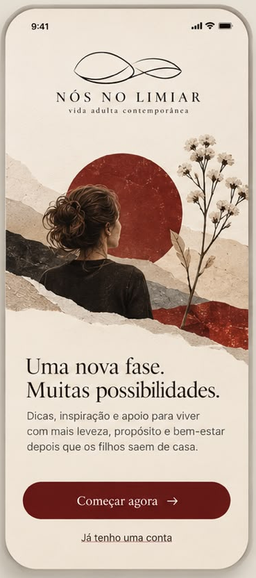
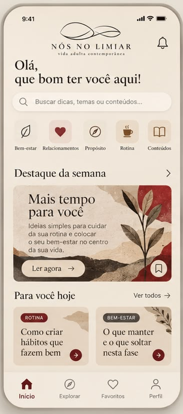
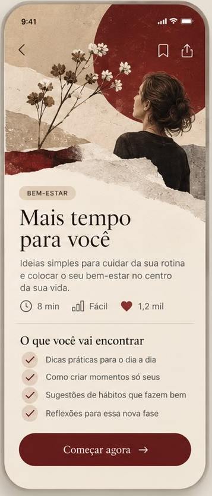
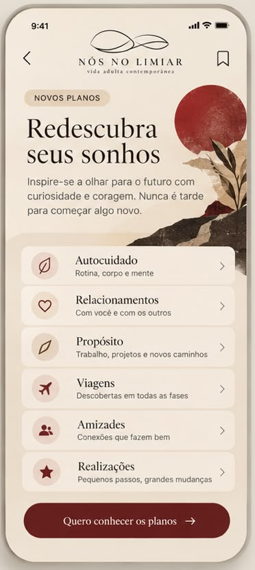

# Mockup v0 — decomposition

> Source: the 4-screen composite mockup shared on 2026-10-03 — [`mockup-v0/00-composite.jpeg`](mockup-v0/00-composite.jpeg),
> split into one file per phone: [`01-splash`](mockup-v0/01-splash.png) · [`02-home`](mockup-v0/02-home.png) ·
> [`03-content-detail`](mockup-v0/03-content-detail.png) · [`04-redescubra-sonhos`](mockup-v0/04-redescubra-sonhos.png).
> Purpose: a precise map of every section and component so the design system can be extracted from it.
>
> **Precision caveat.** This map was made from a single flattened composite (~400 px wide per phone).
> Structure, hierarchy and component inventory are reliable. **Colors, sizes and spacing below are
> estimates** marked `≈`. **Colors in §4 are measured** (pixel-median sampling of the crops), but the
> source is a 1600×873 JPEG, so treat them as ±3 per channel.

---

## 1. Global anatomy (shared by all 4 screens)

| Layer | Observation |
|---|---|
| Device frame | iPhone with Dynamic Island era status bar: `9:41`, signal, wi-fi, battery (system — not ours to draw) |
| Background | Warm cream with subtle **paper grain** texture, not a flat color |
| Side margin | ≈ 24 pt left/right; content left-aligned except the logo lockup |
| Visual identity | Analog **torn-paper collage**: deep red circle ("sun"), torn bands in sand / black / gray / red, dried botanicals (white small-flower branch, leaf sprigs), woman seen from behind/profile |
| Type pairing | **Serif** for logo, headlines, section titles, card titles, *and button labels*; **sans** for body, captions, labels, chips, tab labels |
| CTA shape | Full-width **pill**, wine background, cream serif label + `→` |

---

## 2. Screen-by-screen

### S1 — Splash / welcome (maps to spec screen 01)

| # | Section | Contents | Notes |
|---|---|---|---|
| 1.1 | Status bar | system | |
| 1.2 | **Logo lockup (large)** | line-art mark (two interlaced leaf/eye loops, thin black stroke) · wordmark `NÓS NO LIMIAR` (serif caps, very wide tracking) · tagline `vida adulta contemporânea` (small serif, lowercase, tracked) | centered |
| 1.3 | **Hero collage** | red sun circle (left-center) · woman from behind, dark hair bun, dark top · white-flower branch (right) · torn-paper bands (sand, black, red, gray) forming a horizon | ≈ 45 % of screen height; bottom edge is a torn edge dissolving into the cream bg |
| 1.4 | Headline | `Uma nova fase.` / `Muitas possibilidades.` | serif ≈ 30–32 pt, 2 lines, left |
| 1.5 | Body | `Dicas, inspiração e apoio para viver com mais leveza, propósito e bem-estar depois que os filhos saem de casa.` | sans ≈ 15 pt, warm dark gray, 3 lines |
| 1.6 | **Primary CTA** | `Começar agora →` | wine pill, full width, ≈ 52–56 pt tall |
| 1.7 | Text link | `Já tenho uma conta` | sans, underlined, centered |

### S2 — Home (maps to spec screen 05)

| # | Section | Contents | Notes |
|---|---|---|---|
| 2.1 | **Header** | logo lockup (compact, centered) · bell icon (outline) right | no back button — tab root |
| 2.2 | Greeting | `Olá,` / `que bom ter você aqui!` | serif ≈ 26 pt, 2 lines, left |
| 2.3 | **Search field** | magnifier icon + placeholder `Buscar dicas, temas ou conteúdos...` | pill, lighter-than-bg fill, no visible border |
| 2.4 | **Category shortcuts** | 5 tiles: Bem-estar (leaf) · Relacionamentos (heart, *filled wine*) · Propósito (compass) · Rotina (cup, *filled*) · Conteúdos (open book) | rounded-square tile ≈ 52 pt + label below (sans ≈ 10–11 pt). Tiles 2 & 4 have **tinted** backgrounds (pink-ish / tan) — selected state or per-category tint? → open question |
| 2.5 | Section header | `Destaque da semana` + `›` | serif ≈ 20 pt |
| 2.6 | **Feature card** | collage bg (torn paper, red block, large leaf right) · title `Mais tempo para você` (serif) · body (sans, 4 lines) · secondary pill `Ler agora →` (cream) · circular bookmark button (sand circle, dark outline icon) bottom-right | full width, radius ≈ 16–20 |
| 2.7 | Section header | `Para você hoje` + `Ver todos →` (sans, small, right) | |
| 2.8 | **Compact content cards** (×2, likely a horizontal carousel) | chip `ROTINA` (wine) / `BEM-ESTAR` (charcoal) · title serif 3 lines (`Como criar hábitos que fazem bem` / `O que manter e o que soltar nesta fase`) · circular wine `→` button bottom-right · torn-paper texture + leaf sprig | ≈ half width each, radius ≈ 16 |
| 2.9 | **Tab bar** | Início (house, filled, **wine**, active) · Explorar (compass) · Favoritos (heart) · Perfil (person) | icon + label; inactive = gray outline |

### S3 — Content detail (maps to spec screens 07/08 — see conflict C7)

| # | Section | Contents | Notes |
|---|---|---|---|
| 3.1 | **Full-bleed hero collage** | red sun (top-right) · woman in profile looking up-right · white-flower branch (left) · torn bands (sand, black, red, gray) at bottom | ≈ 38 % height, extends under the status bar |
| 3.2 | Overlay nav | `‹` back (left) · bookmark + share (right) | icons drawn directly on the image, no bar background |
| 3.3 | Chip | `BEM-ESTAR` | **sand** variant, dark text |
| 3.4 | Title | `Mais tempo para você` | serif ≈ 32 pt, 2 lines |
| 3.5 | Description | `Ideias simples para cuidar da sua rotina e colocar o seu bem-estar no centro da sua vida.` | sans ≈ 15 pt |
| 3.6 | **Meta row** | clock `8 min` · bar-chart `Fácil` · heart (filled wine) `1,2 mil` | icon + text, inline, spaced |
| 3.7 | Divider | hairline | |
| 3.8 | Section title | `O que você vai encontrar` | serif ≈ 20 pt |
| 3.9 | **Checklist** (×4) | sand-rose filled circle + wine check + text: `Dicas práticas para o dia a dia` · `Como criar momentos só seus` · `Sugestões de hábitos que fazem bem` · `Reflexões para essa nova fase` | sans ≈ 15 pt |
| 3.10 | Primary CTA | `Começar agora →` | same as 1.6 |
| — | Tab bar | **absent** | pushed (stack) screen |

### S4 — "Redescubra seus sonhos" (no exact spec screen — see conflict C6)

| # | Section | Contents | Notes |
|---|---|---|---|
| 4.1 | **Header** | `‹` back · compact logo (centered) · bookmark (right) | |
| 4.2 | Chip | `NOVOS PLANOS` | sand variant |
| 4.3 | Title | `Redescubra` / `seus sonhos` | serif ≈ 36 pt — **largest type in the set** |
| 4.4 | Body | `Inspire-se a olhar para o futuro com curiosidade e coragem. Nunca é tarde para começar algo novo.` | sans |
| 4.5 | **Corner collage** | red sun + leaves + torn paper bleeding off the right edge, partly *behind* the first list rows | decorative, not full-bleed |
| 4.6 | **List rows** (×6) | icon badge (circle, sand-tinted) · title serif · subtitle sans small · `›` | separate rounded cards with small gaps, lighter fill |
| | | Autocuidado — `Rotina, corpo e mente` (leaf, outline) | |
| | | Relacionamentos — `Com você e com os outros` (heart, outline) | |
| | | Propósito — `Trabalho, projetos e novos caminhos` (quill/leaf, outline) | |
| | | Viagens — `Descobertas em todas as fases` (plane, **filled wine**) | |
| | | Amizades — `Conexões que fazem bem` (people, **filled wine**) | |
| | | Realizações — `Pequenos passos, grandes mudanças` (star, **filled wine**) | |
| 4.7 | Primary CTA | `Quero conhecer os planos →` | same component as 1.6 |
| — | Tab bar | absent | pushed screen |

---

## 3. Component inventory (design-system candidates)

Grouped atoms → molecules → organisms. "Seen in" uses the section ids above.

### Atoms

| Component | Variants observed | Seen in |
|---|---|---|
| `Text` | display (4.3) · h1 (1.4, 3.4) · h2 greeting (2.2) · section title (2.5, 2.7, 3.8) · card title (2.6, 2.8, 4.6) · body (1.5, 3.5, 4.4) · caption (4.6 subtitle, 3.6) · overline/chip (3.3) · tab label (2.9) · link (1.7, 2.7) | everywhere |
| `Logo` | full lockup large (1.2) · compact lockup (2.1, 4.1) · mark only (not seen — likely needed for app icon) | S1, S2, S4 |
| `Icon` | **outline** set (bell, search, leaf, compass, book, clock, bars, bookmark, share, back, chevron, person) · **filled** set (house, heart, cup, plane, people, star) | everywhere |
| `Chip` | wine (2.8) · charcoal (2.8) · sand (3.3, 4.2) — all uppercase, tracked, pill | S2, S3, S4 |
| `Divider` | hairline (3.7) | S3 |
| `TextureBackground` | paper-grain cream | all screens |

### Molecules

| Component | Variants observed | Seen in |
|---|---|---|
| `Button` | **primary** (wine pill, serif label, trailing `→`) · **secondary** (cream pill, serif label, `→`) · **link** (underlined sans) · **text-arrow** (`Ver todos →`) | 1.6, 1.7, 2.6, 2.7, 3.10, 4.7 |
| `IconButton` | **plain** (header: bell, back, bookmark, share) · **circle-filled** wine (`→`, 2.8) · **circle-filled** sand (bookmark, 2.6) | S2, S3, S4 |
| `SearchField` | pill + leading icon + placeholder | 2.3 |
| `CategoryTile` | default · tinted (open question) | 2.4 |
| `SectionHeader` | title + chevron · title + text-arrow action | 2.5, 2.7, 3.8 |
| `MetaItem` | icon + value | 3.6 |
| `CheckItem` | sand-rose filled circle + wine check + text | 3.9 |
| `IconBadge` | circle, sand-tinted, holds an `Icon` | 4.6 |

### Organisms

| Component | Description | Seen in |
|---|---|---|
| `AppHeader` | slots: left (back \| empty) · center (compact logo) · right (1–2 IconButtons) | 2.1, 4.1 |
| `OverlayHeader` | same slots, transparent, drawn over a hero image | 3.2 |
| `HeroCollage` | illustration asset in 3 placements: **top-of-screen** (1.3), **full-bleed under status bar** (3.1), **corner bleed** (4.5) | S1, S3, S4 |
| `FeatureCard` | collage bg + title + body + secondary Button + sand circle IconButton | 2.6 |
| `ContentCard` (compact) | collage/texture bg + Chip + title + circle arrow IconButton | 2.8 |
| `ListRowCard` | IconBadge + title + subtitle + chevron, tappable | 4.6 |
| `MetaRow` | horizontal list of MetaItem | 3.6 |
| `TabBar` | 4 items, icon + label, active = filled wine icon + wine label | 2.9 |
| `StickyCTA` *(to confirm)* | primary Button pinned at the bottom of S1/S3/S4 — fixed or end-of-scroll? | 1.6, 3.10, 4.7 |

---

## 4. Measured colors (pixel-sampled from the crops)

Median of a 7×7 patch on a flat area of each element (text colors: median of the darkest 3–5 % of
pixels in the text block). JPEG source → ±3 per channel.

| Role | Measured | Where sampled | Spec §18 says | Existing `nos-no-limiar/brand` says |
|---|---|---|---|---|
| Background (screen) | `#F0E6D9` (range `#F0E4D6`–`#F1E7DB`) | S1/S2/S3 empty areas | Off-white `#F3F0EA` | Cream `#F4ECE2` |
| Surface raised (search, list rows, tab bar) | `#F6ECE1` (range `#F1E9DE`–`#F8EFE6`) | 2.3, 4.6, 2.9 | — | Bone `#FBF7F2` |
| Category tile (neutral) | `#EEE4D8` | 2.4 Bem-estar / Propósito | — | — |
| Category tile (tinted rose) | `#E9D9CF` | 2.4 Relacionamentos | — | — |
| Category tile (tinted tan) | `#E7DAC8` | 2.4 Rotina | — | — |
| Sand (chips, badges, card base) | `#E2D1BC` (range `#E0CEB7`–`#E4D3BE`) | 3.3, 4.2, 2.6, 2.8 | Areia `#D8CBB8` | Sand `#E8D9CB` |
| Sand-rose (check/icon badges) | `#E5D1C2` (range `#E1CCBC`–`#E8D6C8`) | 3.9, 4.6 | — | — |
| **Wine (primary CTA, chips, active tab)** | **`#651D1A`** (CTAs `#641916` · `#641D1B` · `#66201E`; chip `#6D1F1F`; filled icons `#6B2120`–`#732929`) | 1.6, 3.10, 4.7, 2.8, 4.6 | "sample from the approved mockup" | — (primary is Clay `#B07A6A`) |
| Wine light (heart icons) | `#88322F` (`#893334`, `#86322C`) | 2.4, 3.6 | — | — |
| Illustration red (sun) | `#782B20` (shaded `#632019`, lit `#984A3F`) | 1.3, 3.1, 4.5 | — | — |
| Charcoal (chip) | `#524A44` | 2.8 BEM-ESTAR | — | Soot `#4A3F3A` |
| Ink (headlines) | near-black, darkest `#0F0500` — anti-aliasing makes true ink ≈ `#1A120D`–`#222222` | 1.4, 3.4 | Preto `#222222` | Ink `#2B2320` |
| Body text | `#625A4F` | 1.5 | — | Soot `#4A3F3A` |
| Caption / link text | `#5A5247`–`#766D63` | 2.7, 4.6 | — | — |
| Tab inactive | `#908A7F` | 2.9 | — | — |
| Divider | `#E6DACB`-ish hairline (barely visible) | 3.7 | — | Sand |

### Non-color tokens (still `≈`, from layout proportions at 393-pt device width)

| Token | Estimate |
|---|---|
| `font.serif` (headlines, buttons, card titles) | high-contrast editorial serif — **not identified** |
| `font.wordmark` | roman caps, very wide tracking |
| `font.sans` (body, chips, tabs) | neutral humanist sans — **not identified** |
| `radius.pill` | buttons, chips, search |
| `radius.card` | ≈ 16–20 |
| `radius.tile` | ≈ 12–14 |
| `space.gutter` | ≈ 24 |
| `size.cta-height` | ≈ 52–56 |
| `elevation` | none / very soft — separation is by fill contrast |

---

## 5. Assets to obtain (not extractable from the composite at production quality)

1. Logo mark — vector (SVG).
2. Wordmark + tagline — vector, or the font files used.
3. Collage illustrations, ideally **layered** (sun, woman, botanicals, torn bands as separate PNG/SVG) so they can be recomposed per placement: splash hero, detail hero, feature-card bg, 2 compact-card bgs, S4 corner.
4. Paper-grain texture tile.
5. The icon set (or the name of the icon library used).
6. Exact font families + licenses (must allow app embedding).

---

## 6. Divergences between mockup and spec — need a human decision

| id | Mockup | Spec | Section |
|---|---|---|---|
| C1 | Tab `Favoritos` | Tab `Salvos` | §3 |
| C2 | Heart used for tab, category, "likes" | "evitar corações excessivos" | §18 |
| C3 | Meta `1,2 mil` (heart count) | No community/social metrics in MVP; no engagement gamification | §4.5, §23 Fase 4 |
| C4 | Copy: `apoio … depois que os filhos saem de casa`, `coragem. Nunca é tarde…`, `Pequenos passos, grandes mudanças` | No presuming suffering; no motivational slogans / self-help tone | §2, §2.1 |
| C5 | Home = search + categories + editorial feed | Home = intents "O que combina com hoje?" + **Me tira do sofá** (core feature) — absent from mockup | §4.2, §4.3 |
| C6 | S4 `NOVOS PLANOS` / `Quero conhecer os planos` | "Planos" = life plans **or** paid plans? Monetization is open (§24 Q3) and must never sit near safety flows | §16, §24 |
| C7 | S3 is an *article* detail (meta, "what you'll find") | Activity card = time · materials · 3–5 steps · variation · post-activity question | §4.4 |
| C8 | Categories: Bem-estar, Relacionamentos, Propósito, Rotina, Conteúdos / Autocuidado, Viagens, Amizades, Realizações | Six worlds: Quem sou eu agora? · Filhos adultos · O que faço com esse tempo? · Nós dois agora · Meu mundo pode aumentar · Experimenta isso | §3.1 |
| C9 | Search field on Home | Not in spec | — |
| C10 | `Já tenho uma conta` implies accounts | Mandatory account vs guest mode is open | §24 Q2 |
| C11 | Splash has no "o que é / o que não é" | Onboarding screen 02 must state it is not clinical care | §4.1, §19 |
| C12 | Mixed outline/filled icons in S4 list and S2 tiles | — consistency decision | — |
